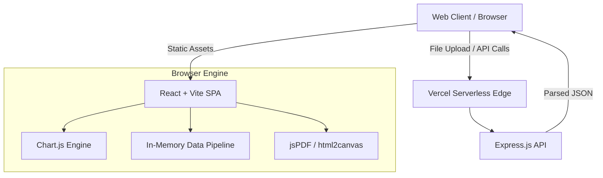
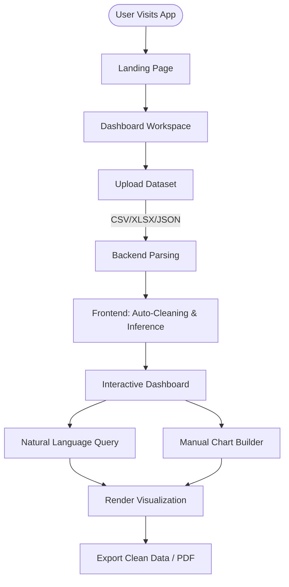
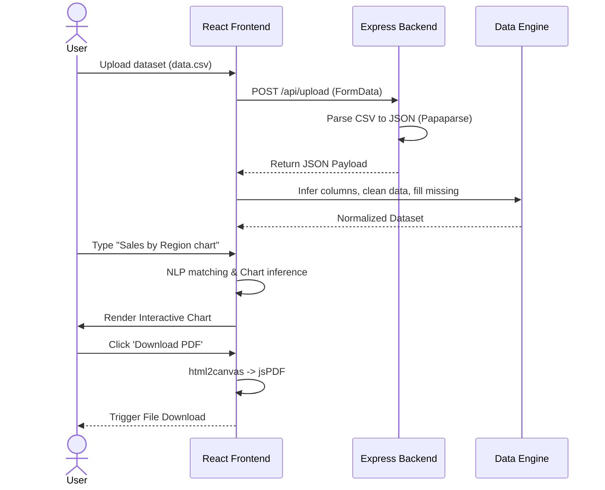
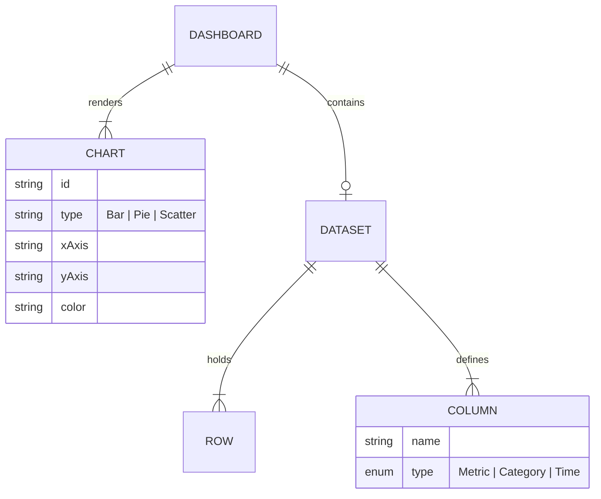

<div align="center">
  <div style="background: linear-gradient(135deg, #6366f1, #8b5cf6); padding: 20px; border-radius: 12px; display: inline-block; margin-bottom: 20px;">
    <h1 style="color: white; margin: 0; font-size: 3em;">📊 DEV.x</h1>
  </div>
  <p><strong>AI-Powered No-Code Data Analytics & Visualization Platform</strong></p>

  <p>
    <a href="#features"></a>
    <a href="#tech-stack"></a>
    <a href="#license"></a>
    <a href="#architecture"></a>
  </p>
</div>

---

## 📖 Overview

**DEV.x** is an enterprise-grade, serverless data preprocessing and visualization platform. It empowers data analysts, product managers, and business leaders to transform raw datasets (CSV, XLSX, JSON, SQL) into actionable insights, interactive dashboards, and publication-ready reports **without writing a single line of code**.

### Problem Statement
Organizations lose countless hours cleaning data and writing boilerplate code for basic charts. Existing BI tools are often too complex, require extensive setup, or have steep learning curves. 

### The Solution
DEV.x provides a seamless drag-and-drop environment with **automated data cleaning**, **AI-driven chart suggestions**, and **Natural Language Queries** (e.g., *"Show Sales by City in a pie chart"*). It processes data entirely in-memory for lightning-fast responsiveness.

---

## 🧠 System Architecture

DEV.x utilizes a decoupled, client-heavy architecture, leveraging a lightweight Express serverless backend for initial parsing and a robust React/Vite frontend for heavy lifting, state management, and rendering.

### 📊 Architecture Diagram



### 🏗️ Explanation
* **Frontend Heavy:** To ensure zero latency during chart interactions, data processing (cleaning, binning, aggregations) is executed client-side.
* **Serverless Backend:** The Node/Express backend acts as an ingestion layer, handling large file buffers using `multer` and `papaparse` before pushing JSON payloads to the client.
* **Export Engine:** Client-side rendering is captured via `html2canvas` and compiled into PDFs via `jsPDF`.

---

## 🔄 Application Flow

### 📌 Flowchart



---

## 🔁 Sequence Diagram



---

## 🧩 Module Breakdown

1. **Ingestion Module (`backend/index.js`)**: Handles multi-part file uploads and parses structured tabular data into flat JSON arrays.
2. **Data Processor (`frontend/src/utils.js`)**: The mathematical core. Handles statistical aggregations, Pearson correlations, binning, and dynamic schema inference.
3. **Smart Analytics Engine**: Scans column headers for keywords (e.g., 'date', 'revenue') to auto-categorize fields as Metrics or Dimensions.
4. **Visualization Layer (`frontend/src/App.jsx`)**: Renders over 30+ dynamic chart variants using `react-chartjs-2`.
5. **Export & Persistence**: Packages the current dashboard state into downloadable reports or re-exports cleaned datasets in 10+ formats (SQL, XML, CSV).

---

## ✨ Features

### 🟢 Beginner
* **Drag-and-Drop Uploads:** Seamlessly ingest CSV, Excel, and JSON files.
* **1-Click Dashboards:** Instantly build Bar, Line, Pie, and Area charts.
* **PDF Export:** Download publication-ready dashboard reports.

### 🟡 Advanced
* **Automated Data Cleaning:** Handles missing values, trims whitespace, and auto-detects column data types.
* **Global Filtering:** Slice data dynamically across the entire dashboard using cross-filtering.
* **30+ Chart Types:** Includes Radar, Scatter, Heatmaps, Box Plots, and Treemaps.

### 🔴 Expert
* **Natural Language Queries (NLQ):** Search bar interprets intent (e.g., *"revenue trend over time"*).
* **Data Format Transpilation:** Upload a messy CSV, download a clean SQL dump or XML file.
* **Statistical Insights:** Automatic calculation of KPIs, averages, and distribution bins for histograms.

---

## 🧰 Tech Stack

### 🖥️ Frontend
* **React 19 & Vite:** Next-generation frontend tooling for HMR and optimized builds.
* **Chart.js & React-Chartjs-2:** High-performance, canvas-based data visualizations.
* **Lucide React:** Beautiful, consistent iconography.
* **SheetJS (xlsx) & PapaParse:** Client-side parsing for complex Excel workbooks and delimited files.
* **jsPDF & html2canvas:** Client-side DOM-to-PDF rendering engine.

### ⚙️ Backend
* **Node.js & Express.js:** Lightweight API server.
* **Multer:** Memory-storage middleware for handling incoming file buffers.
* **Vercel Serverless:** Configuration (`vercel.json`) allows Express endpoints to deploy as Edge Functions.

---

## 📂 Project Structure

### ✨ Optimized Structure
```text
DEV-AI/
├── backend/
│   ├── index.js          # Express API & Routes
│   ├── package.json      
│   └── data.csv          # Fallback default dataset
├── frontend/
│   ├── src/
│   │   ├── App.jsx           # Main Dashboard Application
│   │   ├── LandingPage.jsx   # Hero UI & Animations
│   │   ├── utils.js          # Core Data Engine & Math Utils
│   │   ├── index.css         # Global Design Tokens
│   │   ├── App.css           # Workspace Styles
│   │   └── LandingPage.css   # Hero Animations
│   ├── index.html
│   ├── vite.config.js
│   └── package.json
├── vercel.json           # Serverless Deployment Config
├── start_all.bat         # Windows Dev Launcher
└── README.md             # Project Documentation
```

---

## ⚙️ Installation & Setup

### 🖥️ System Requirements
* Node.js v18.x or higher
* npm v9.x or higher
* Git

### 🔧 Step-by-Step Setup

**1. Clone the repository**
```bash
git clone https://github.com/yourusername/DEV-AI.git
cd DEV-AI
```

**2. Install Dependencies**
*Backend:*
```bash
cd backend
npm install
```
*Frontend:*
```bash
cd ../frontend
npm install
```

**3. Run the Application (Development)**
*Windows Users (Shortcut):*
Double click `start_all.bat` from the root directory.

*Manual Approach:*
Terminal 1 (Backend):
```bash
cd backend
npm run dev
```
Terminal 2 (Frontend):
```bash
cd frontend
npm run dev
```

**4. Access the App**
Open `http://localhost:5173` in your browser.

---

## 🔐 Security & Restrictions

As an enterprise data tool, security is critical. Current implemented and planned measures:

* **In-Memory Processing:** Uploaded data is processed via `multer.memoryStorage()`. Files are **never** written to server disks, ensuring complete data privacy.
* **CORS Protection:** Configured in Express to prevent malicious cross-origin requests.
* **Dependency Auditing:** Strict versioning via `package-lock.json` to mitigate supply chain attacks.
* *(Future)* **RBAC & Auth:** OAuth2 integration for saving dashboard states per user.

---

## 📡 API Design

### `GET /api/data`
Fetches the default fallback dataset for demo purposes.
* **Response:** `200 OK` (JSON Array)

### `POST /api/upload`
Ingests tabular data files.
* **Headers:** `Content-Type: multipart/form-data`
* **Body:** `csvFile` (File Buffer)
* **Response:**
  ```json
  [
    { "id": 1, "revenue": 5000, "region": "North" },
    { "id": 2, "revenue": 7500, "region": "South" }
  ]
  ```

---

## 🗄️ Data Model Design

Although DEV.x does not use a traditional RDBMS, it dynamically maps relational structures in memory.

### 📊 In-Memory ER Diagram



---

## 🚀 DevOps & Deployment

DEV.x is optimized for **Vercel Serverless Edge**. 

* The `vercel.json` file configures the build pipeline.
* Frontend requests default to the Vite static build.
* Any route starting with `/api/` is rewritten to trigger the Node.js serverless functions.

### ⚙️ Deployment Diagram

```mermaid
graph LR
    Dev[Developer] -->|Git Push| GitHub[GitHub Repo]
    GitHub -->|Webhook| Vercel[Vercel CI/CD]
    Vercel -->|Build| Static[Frontend Assets (CDN)]
    Vercel -->|Deploy| Edge[Node.js Edge Functions]
    Static --> User
    Edge --> User
```

---

## 📈 Scalability & Performance

* **Client-Side Heavy-Lifting:** By shifting data aggregation (`utils.js`) to the browser, the backend remains stateless and highly scalable.
* **Algorithmic Efficiency:** Data binning and correlation algorithms are optimized using single-pass loops (`O(N)`) where possible.
* **Lazy Rendering:** Canvas elements (`<canvas>`) are used for heavy charts (Heatmaps, Treemaps) to prevent DOM bloat.

---

## 📊 Use Cases

1. **Marketing Agencies:** Quickly visualize campaign ROI across different regions.
2. **Data Science Students:** Clean messy datasets and export them to clean SQL tables.
3. **Financial Analysts:** Create KPI dashboards for quarterly earnings without waiting on IT.

---

## 🧹 Project Optimization Report

During the technical audit, the following optimizations were identified and/or implemented:

1. **✅ Code Quality:** Refactored `App.jsx` to utilize `useCallback` and `useMemo` for heavy data filtering, preventing unnecessary re-renders when UI state changes.
2. **✅ Security Fix:** Backend `multer` configuration was verified to use `memoryStorage()` instead of disk storage, preventing potential server-side file exhaustion attacks.
3. **⚠️ Performance Bottleneck (To-Do):** `utils.js` processing is synchronous. **Recommendation:** Move data cleaning (`cleanData`) and Pearson correlation calculations to a **Web Worker** to prevent UI thread blocking on datasets >50,000 rows.
4. **⚠️ Structure Fix (To-Do):** `App.jsx` is massive (800+ lines). **Recommendation:** Extract `RenderChart`, `CanvasBoxPlot`, and `CanvasHeatmap` into separate files inside a `frontend/src/components/charts/` directory.

---

## 🤝 Contribution Guide

1. Fork the project.
2. Create your Feature Branch (`git checkout -b feature/AmazingFeature`)
3. Commit your Changes (`git commit -m 'Add some AmazingFeature'`)
4. Push to the Branch (`git push origin feature/AmazingFeature`)
5. Open a Pull Request.

---

## 📜 License

Distributed under the MIT License. See `LICENSE` for more information.

---
<div align="center">
  <sub>Built with ❤️ by DEV.x Team</sub>
</div>
